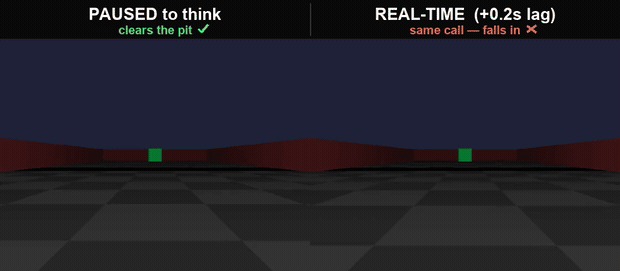
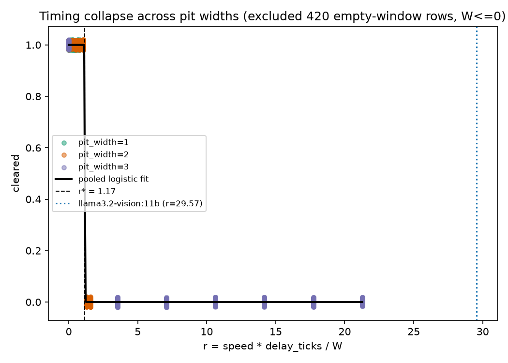
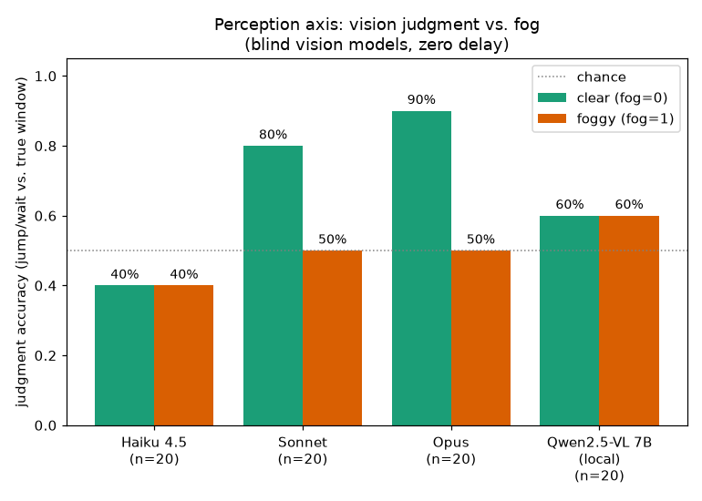
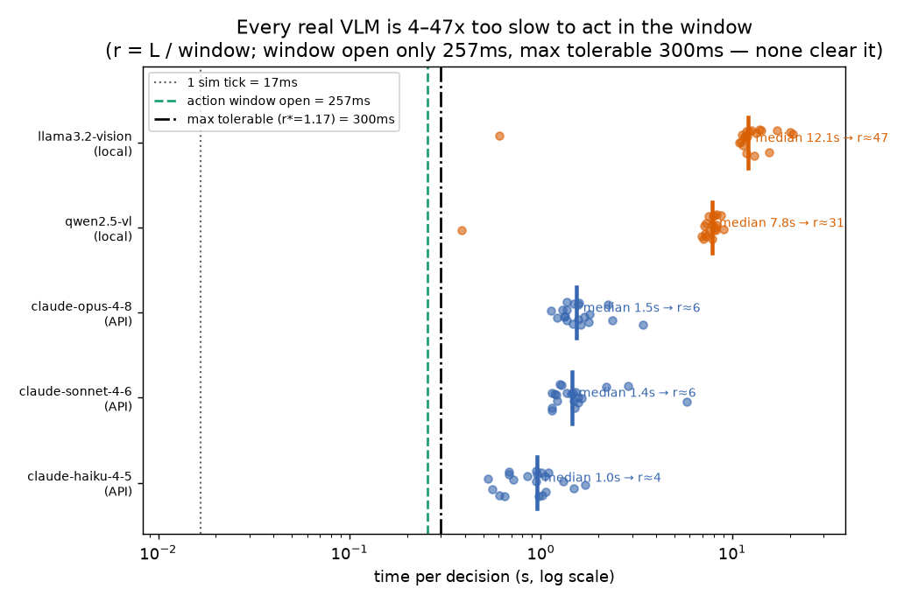
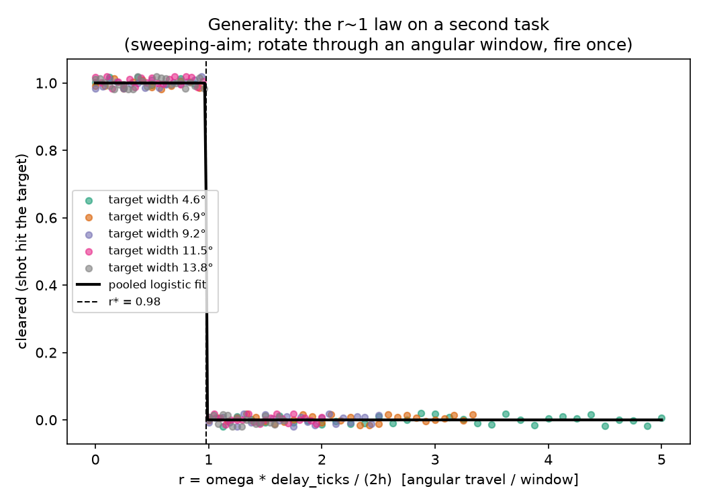
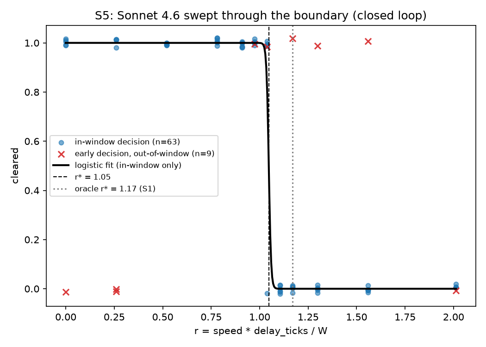

# When the AI isn't dumb, it's just late

*A first-person jumping game where the hard part is judging distance — and what it
teaches about why vision models "can't play games."*

It started as a toy: a little first-person raycaster with one pit in the floor.
You walk forward, and the only thing you ever decide is *when to jump*. In first
person there's no map, no bird's-eye view — you're guessing at depth from a flat
image, the same handicap a person gets. That made it an interesting thing to point
a vision model at: the difficulty is *perception*, and perception is exactly what
these models are supposed to be good at now.

So I let an agent play it. And the result was more interesting than "it works" or
"it doesn't."

Same agent, same rules, both panels. On the **left** the world pauses while the
agent thinks — it clears the pit every time. On the **right** the world runs in
real time and the decision lands 0.2 seconds late — it walks straight into the
pit, over and over. It made the **right call** both times. The only thing that
changed was whether it had time to act on it.

That gap — between judging right and acting in time — turned out to be measurable,
and it splits cleanly into two independent failures. This is the short version;
the [full writeup](judge-vs-react.md) has the method and the prior-art
positioning.

## The setup

You auto-walk toward a pit. The only decision is *when* to jump. Jump too early
and you land short, inside the pit; too late and you walk into it. There's a
narrow window of positions from which a jump clears — that window is the whole
game.

To study it, the sim is deterministic and headless, and it lets you inject a
control **delay**: a decision made at tick *t* gets applied at tick *t+D*. That
knob is the trick — it lets us vary *lateness* completely separately from
*judgment quality*. A perfect-judgment "oracle" that knows the true distance
still fails if its action is applied too late.

## The twist: it's not that the model judges wrong

Watch the two panels again. The decision is identical — same position, same "jump
now." Paused, it clears with probability **1.00**. Once the delay pushes the
action past the window, the *same decision* clears only **0.11** of the time. The
judgment never changed. Only the timing did.

## The number

Put the delay sweep together and the failure has a sharp boundary. Define

> **r = how far you travel while thinking ÷ how wide the safe-jump window is.**

Below `r ≈ 1` you clear; above it you fall. Across pits of different widths — each
with a different window — the clear/fail outcomes **collapse onto that one ratio**,
with the transition at **r ≈ 1.17**.

And holding your last decision across frames — the usual "just act faster" hack —
doesn't rescue it. A stale "don't jump" still walks you in; if anything it fails
slightly *earlier*, because the decision lands staler.

## But can it even see the jump?

Latency is one axis. The other is whether the model can judge the gap at all — so
we tested that directly, blind. We froze the game at a spread of standing
positions, shuffled the frames into neutral names, and asked vision models to call
JUMP or WAIT from the **image alone** — no coordinates, no window, no labels — then
scored each call against the true window.

With a clear view, the strong models genuinely see it: **Opus 90%, Sonnet 80%**.
Then we add fog that hides the pit's *distance* — and their accuracy falls to
chance (50%), missing every in-window frame. The neat part: that collapse shows up
**only in the models that were actually reading depth**. A weaker judge that never
used the depth cue (it just guesses "jump") doesn't drop under fog — it has no
perception to lose. The fog collapse is a *signature of genuine depth perception*.

Crucially, this is all at **zero delay**. Perception and timing are separate axes:
a model can fail because it can't see the gap, or because it sees it and acts too
late — and now we can tell which.

## How slow is "too slow"?

Because `r = latency ÷ window`, and the window here is open for only about **257
milliseconds**, the boundary sets a hard budget: your decision has to arrive in
under ~**300 ms**. So we measured how long a real decision actually takes, for five
vision models on the same frames.

**Nobody makes the budget.** The fastest hosted frontier model decides in ~1
second — already ~4× too slow. Local open models run 8–12 seconds — 30–47× too
slow. Every real model we tried lands on the failing side of the line, in its
*fastest* configuration. The gap isn't a quirk of one model; it's the time regime.

## Is it just the pit?

Fair question — one toy task proves nothing. So we built a second, deliberately
*different* one: instead of jumping a gap, you spin in place and have to **fire
the instant your crosshair sweeps across a target**. Different motion (rotation,
not walking), different action (shoot, not jump) — but the same shape: act inside
a window, and a delay drags you past it.

Same collapse. Same boundary, at **r ≈ 1** again. When two tasks that share
nothing but "act in a window" land on the same number, it stops being a quirk of
the pit and starts being a *law* about timing.

## Flying a real model through the boundary

Everything above maps the boundary with a perfect-judgment oracle. Does a *real*
model actually feel it? We put Sonnet in the loop for 72 full episodes: it looks
at every frame of the approach, calls WAIT or JUMP from the image alone, and its
committed jump is applied D ticks later. Sweeping D sweeps r straight through
the boundary — with the model's own judgment, and its own mistakes, in the loop.

Below the boundary it clears **32/32**. Above it, **0/26**. The fit lands at
**r\* = 1.05** — the oracle's cliff, felt by a real model. (Two honest
footnotes: it needed a rewritten prompt to judge close-range frames at all — up
close the pit stops looking like a "band" and becomes the whole bottom of the
screen — and a rule that it must say JUMP on two consecutive frames, because even a
rare hallucinated JUMP — a percent or two per frame in our early prompt tests —
fires almost surely *somewhere* over 90 frames of approach.)

The best part is what happens past the cliff. Nine episodes misjudged and
committed early — a perception error, and at small delays they all die, landing
short. But in a middle band of delays, **every one of them cleared**: the delay
pushed their too-early jump right into the window. Past the boundary, the only
survivors are the episodes that judged *wrong*. The two failure axes don't just
separate — on opposite sides of the line they cancel, and an aggregate score
can't see it happening.

## Why it matters

"VLMs are too slow to play games" is half true, and the missing half is the
useful one. In a game that lets you **pause to think** — turn-based, or a
paused-decision mode — a slow-but-accurate model is fine: `r → 0`, and the same
model that faceplants in real time clears every pit. In a real-time game it fails
not because it's a bad judge but because it's late.

If you're deploying a vision model as a controller, the first lever most people
reach for is "make the model faster." This says the other lever is often bigger:
**does the environment let it stop the clock?** Judge versus react — and most of
the time, the model can judge.

---

*Full method, numbers, and prior-art positioning:
[`judge-vs-react.md`](judge-vs-react.md). Code, data, and figures live in
`eval/pit/`. It started as a raycaster with one jumpable pit.*
